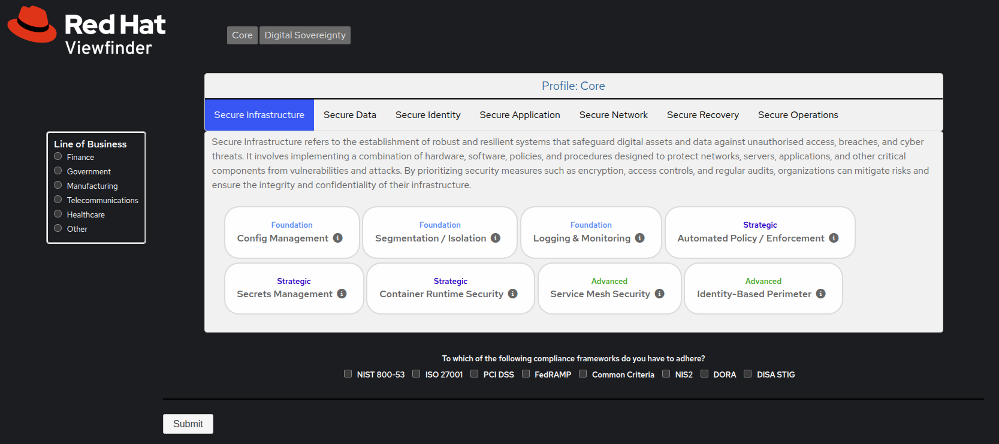
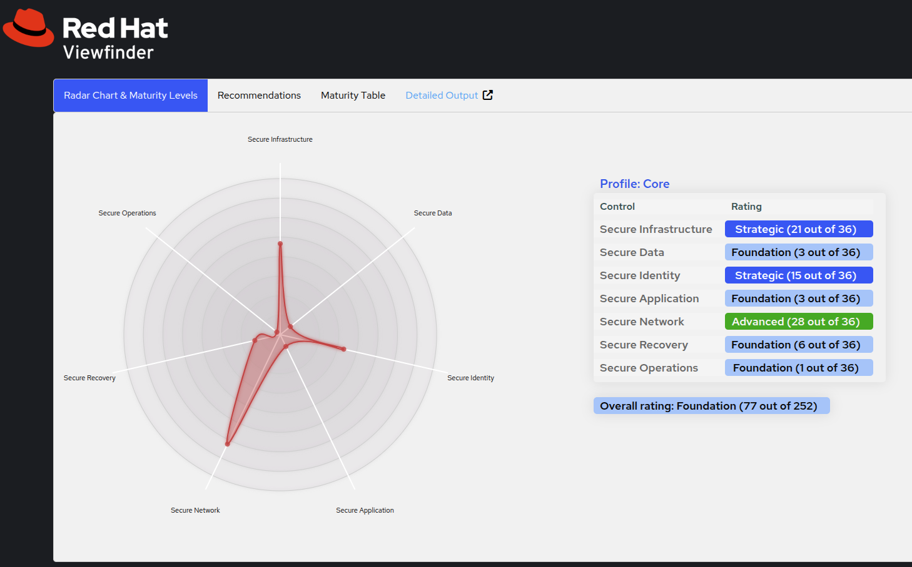
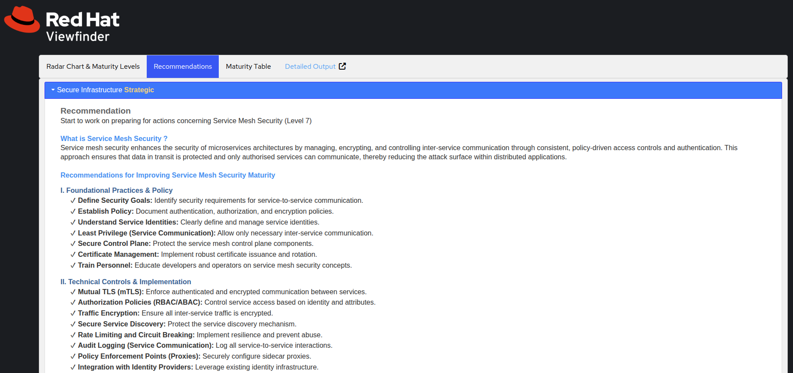

# Viewfinder - Maturity Assessment Tool

## Overview

Viewfinder is a comprehensive web-based Maturity Assessment tool designed to help organizations evaluate their cybersecurity or digital sovereignty posture across multiple domains and compliance frameworks. The application provides detailed recommendations for improving maturity based on industry best practices and regulatory requirements.

### Key Features

- **Multi-Profile Assessments**: Support for Core Security and Digital Sovereignty assessments
- **Industry-Specific Guidance**: Tailored recommendations for Finance, Government, Healthcare, Manufacturing, Telecommunications, and other industries (currently only for the Security profile)
- **Compliance Framework Mapping**: Integration with NIST 800-53, PCI DSS, ISO 27001, FedRAMP, NIS2, DORA, and DISA STIG
- **Interactive Visualizations**: Radar charts and maturity tables for easy interpretation of results
- **Modular Architecture**: Clean, maintainable codebase with separation of concerns

## Screenshots

### Main Assessment Interface


### Results Dashboard


### Recommendations View


### Maturity Analysis


## Quick Start

### Installation

#### Option 1: Container Deployment (Recommended)

```bash
# Clone the repository
git clone https://gitlab.com/redhat/services/products/viewfinder
cd viewfinder

# Build with Podman (or Docker)
podman build -t viewfinder:latest .

# Run the container
podman run -p 8080:8080 localhost/viewfinder
```

#### Option 2: Use Pre-built Image

```bash
# Pull and run the pre-built image
podman pull quay.io/rhn_gps_cjenkins/viewfinder
podman run -p 8080:8080 quay.io/rhn_gps_cjenkins/viewfinder
```

### Access the Application

Once running, open your browser and navigate to:
- **Container**: [http://localhost:8080](http://localhost:8080)

## Architecture

### Technology Stack

- **Backend**: PHP 8.1 with object-oriented architecture
- **Frontend**: HTML5, CSS3, JavaScript (jQuery)
- **UI Framework**: PatternFly (Red Hat Design System)
- **Visualization**: D3.js for radar charts
- **Data Storage**: JSON-based configuration files
- **Container**: Red Hat UBI 9 with PHP 8.1


### Core Components

#### Assessment Engine
- **Config**: Centralised configuration management
- **Assessment**: Core assessment logic and control processing
- **ResultsProcessor**: Results calculation and recommendation generation
- **TemplateRenderer**: Consistent HTML template rendering


## Usage Guide

### Conducting an Assessment

1. **Select Assessment Profile**:
   - **Core**: Comprehensive security maturity assessment
   - **Digital Sovereignty**: Digital Sovereignty readiness considerations

2. **Choose Line of Business**:
   - Select your industry for tailored recommendations
   - Options: Finance, Government, Healthcare, Manufacturing, Telecommunications, Other

3. **Complete Security Controls**:
   - Navigate through domain tabs
   - Select applicable capabilities for your organization
   - Use info icons for control descriptions

4. **Select Compliance Frameworks**:
   - Choose relevant regulatory frameworks
   - Multiple selections supported

5. **Submit Assessment**:
   - Review selections
   - Submit for processing

### Interpreting Results

#### Maturity Levels
- **Foundation**: Basic controls in place
- **Strategic**: Intermediate posture with some automation
- **Advanced**: Mature program with comprehensive automation

#### Results Tabs
- **Radar Chart**: Visual representation of posture across domains
- **Recommendations**: Specific improvement suggestions based on gaps
- **Maturity Table**: Detailed scoring breakdown
- **Compliance Frameworks**: Framework-specific guidance (if selected)
- **Industry Specifics**: Line-of-business recommendations (if applicable)


### Assessment Data Structure

The assessment uses a structured JSON format for controls:

```json
{
  "Domain-1": {
    "title": "Domain Title",
    "overview": "Domain description",
    "qnum": "1",
    "1": "Control Name",
    "1-summary": "Control description",
    "1-tier": "Foundation|Strategic|Advanced",
    "1-points": "1-5",
    "1-recommendation": "HTML formatted recommendations"
  }
}
```

## Contributing

We welcome contributions! Please read our contributing guidelines:

1. Fork the repository
2. Create a feature branch (`git checkout -b feature/amazing-feature`)
3. Make your changes following coding standards
4. Add tests for new functionality
5. Commit your changes (`git commit -m 'Add amazing feature'`)
6. Push to the branch (`git push origin feature/amazing-feature`)
7. Open a Pull Request

### Development Guidelines

- Follow existing code style and patterns
- Add appropriate error handling
- Include security considerations
- Update documentation as needed
- Test changes thoroughly

## Troubleshooting

### Common Issues

## License

This project is licensed under the terms specified in the [LICENSE](LICENSE) file.

## Support and Contact

- **Maintainer**: Chris Jenkins (chrisj@redhat.com)

## Acknowledgments

- Red Hat for PatternFly design system
- OpenSSF for security scorecard
- Community contributors and users

---

**Disclaimer**: This application is provided for informational purposes only. The information is provided "as is" with no guarantee or warranty of accuracy, completeness, or fitness for a particular purpose.