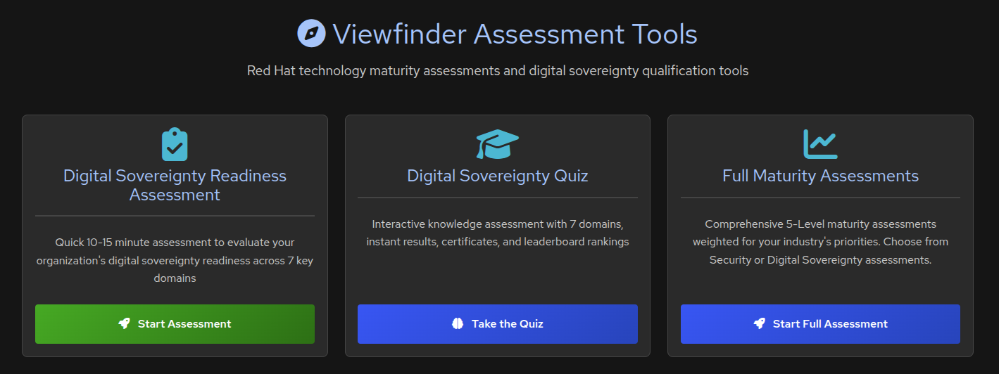
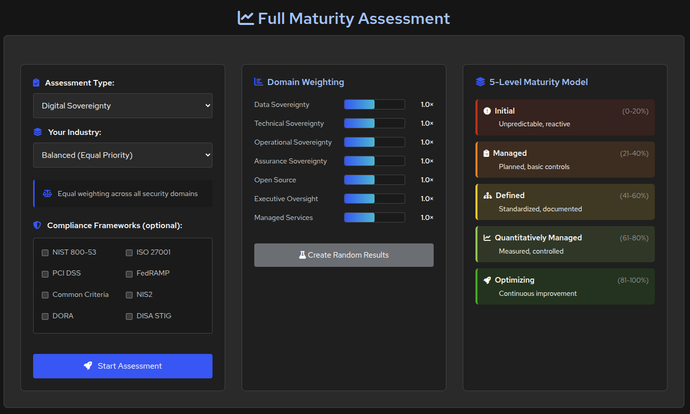
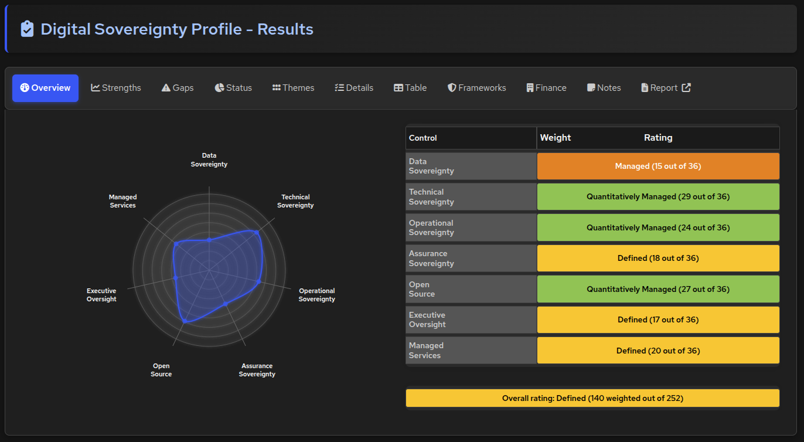
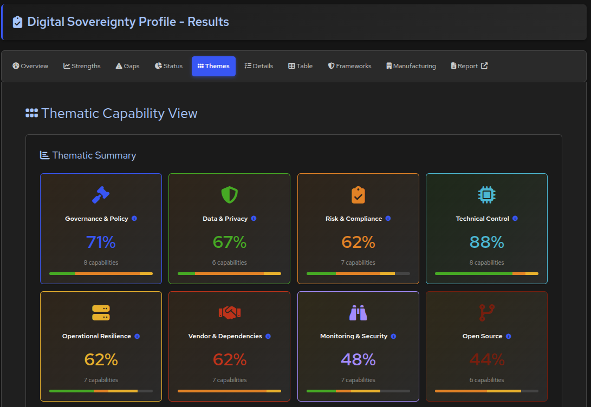
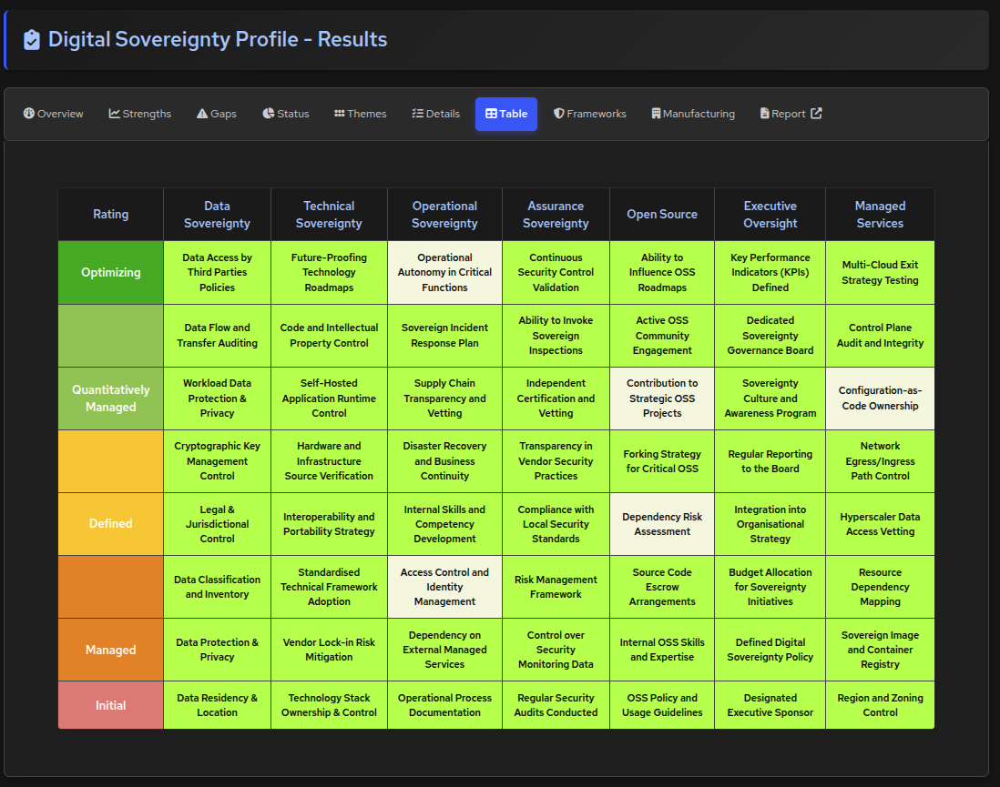

# Maturity Assessment Tool

A comprehensive web-based assessment platform for evaluating organizational maturity across multiple domains including Security, Digital Sovereignty, AI Readiness, multiple technology and operational domains.

## Overview

This is a dynamic assessment tool designed to help organizations measure and visualize their maturity levels across various technology and operational domains. The platform provides interactive assessments, real-time scoring, visual analytics, and detailed recommendations for improvement based on industry best practices and regulatory requirements.

## Screenshots

### Landing Page


### Main Assessment Interface


### Results Page


### Thematic Output


### Maturity Table



## Key Features

### Assessment Capabilities
- **Multi-Profile Assessments**: Security, Digital Sovereignty, AI Readiness, OpenShift, RHEL, and custom profiles
- **Multi-Domain Evaluation**: Multiple control domains per profile (e.g., Digital Sovereignty has 5 main domains with integrated sub-pillars)
- **5-Level Maturity Model**: ✨ Initial, Managed, Defined, Quantitatively Managed, Optimizing (industry-standard progressive framework)
- **8 Capability Levels**: Progressive maturity scoring from 1-8 points per domain
- **Real-time Scoring**: Dynamic calculation of maturity scores as assessments are completed
- **Industry-Weighted Scoring**: ✨ Domain weights adjusted based on Line of Business (Finance, Healthcare, Government, etc.)
- **Framework Mapping**: Map assessments to NIST 800-53, PCI DSS, ISO 27001, FedRAMP, NIS2, DORA, DISA STIG
- **Industry-Specific Guidance**: Tailored recommendations for Finance, Government, Healthcare, Manufacturing, Telecommunications
- **Workshop Facilitator Notes**: ✨ Capture domain-specific notes during facilitated workshops - notes flow through results, detailed reports, and export/import
- **Export/Import Results**: ✨ Save and restore completed assessment results for record-keeping, sharing, and comparison

### Visualization & Reporting
- **Interactive Radar Charts**: D3.js-powered visualizations of maturity across domains
- **Enhanced Results Tabs**: ✨ Icon-based tab navigation with comprehensive views
  - **Overview**: Radar charts and executive summary with QR code for sharing
  - **Strengths**: Domain strengths analysis with quick wins and leverage opportunities
  - **Gaps**: Critical gaps analysis with business impacts and first steps for remediation
  - **Details**: Comprehensive recommendations and improvement roadmap
  - **Table**: Tabular view of all domain scores and maturity levels
- **Dynamic Executive Summary**: ✨ Personalized one-page summary showing:
  - Overall maturity level and score
  - Top 2 strengths to celebrate
  - Critical gaps prioritized by industry weight
  - Strategic recommendations tailored to assessment results
- **Actionable Insights**: ✨ Business-focused analysis for each domain
  - **Business Impact**: Consequences of gaps in each domain
  - **First Steps**: Specific 90-day action plans for addressing critical gaps
  - **Quick Wins**: Tactical improvements to leverage existing strengths
- **Detailed Recommendations**: HTML-formatted guidance for improving maturity levels
- **Workshop Notes in Reports**: ✨ Facilitator notes displayed in both results page and detailed PDF reports
- **Compliance Mapping**: Link capabilities to compliance framework controls
- **Maturity Tables**: Tabular view of scores and recommendations with 5-level color coding
- **Framework-Specific Views**: Detailed compliance guidance per selected framework
- **Industry-Specific Views**: Sector-specific recommendations

### Vendor Solutions Integration ✨ NEW
- **Solution Recommendations**: vendor products mapped to specific capability gaps
  - Automatically displays relevant vendor solutions for incomplete capabilities
  - 14 solutions pre-configured for Digital Sovereignty profile
  - 56 capability slots available for Security profile
  - Solutions include product name and contextual description
- **Visual Design**: Professional vendor branding with distinctive styling
  - Red-bordered boxes with vendor logo (cube icon)
  - Dark theme with red gradient for results page
  - Light theme with pink background for PDF reports
  - Consistent branding across all displays
- **Flexible Architecture**: Easy to add, update, or remove solutions
  - JSON-based configuration in controls files
  - Empty placeholders provided for team to fill in
  - Solutions only display when capability needs improvement
  - No impact on capabilities without vendor solutions
- **Testing Tools**: Dedicated test files for validation
  - `test-vendor-quick.php` - Quick test showing 3 key solutions
  - `test-vendor-solutions.php` - Comprehensive test of all 14 solutions
  - Automated test data generation for realistic scenarios
- **Team Documentation**: Complete guides for adding solutions
  - `HOW-TO-ADD-VENDOR-SOLUTIONS.md` - Step-by-step guide for team
  - `VENDOR-SOLUTIONS.md` - Technical reference
  - `TESTING-VENDOR-SOLUTIONS.md` - Testing procedures
  - `IMPLEMENTATION-SUMMARY.md` - Overview and statistics

### Workshop Facilitation Materials ✨ NEW
- **Comprehensive Facilitator Guide**: Professional guide for conducting Digital Sovereignty assessments
  - Interactive web version (`facilitator-guide.php`) with collapsible sections
  - Downloadable PDF version (`Facilitator-Guide.pdf`) for offline reference
  - Complete coverage of all 7 Digital Sovereignty domains with detailed guidance
  - Assessment methodology and scoring approach
  - Facilitation best practices and tips
  - Dark theme consistent with application styling
- **Workshop Templates Library**: Professional templates accessible via `templates/index.html`
  - **Full-Day Workshop Agenda**: 6-7 hour comprehensive assessment format
    - Pre-workshop preparation checklist
    - Detailed timeline with breaks and activities
    - Post-workshop deliverables and follow-up
  - **Short Workshop Agenda**: 2-hour quick assessment format
    - Condensed timeline for rapid evaluations
    - Focus on high-priority domains
  - **Email Templates**: 5 professional templates for workshop communication
    - Workshop invitation with preparation requirements
    - Pre-workshop preparation reminder
    - Post-assessment thank you with next steps
    - Roadmap planning session invitation
    - Quarterly check-in for progress tracking
  - **Executive Summary Template**: One-page format for C-suite presentation
    - Key findings and maturity overview
    - Top strengths and critical gaps
    - Strategic recommendations
    - Visual charts and metrics
- **Vendor Branding**: Professional logo integration throughout materials
- **Print-Optimized Design**: All templates formatted for professional printing

### Landing Page Dashboard ✨ NEW
- **Unified Entry Point**: Clean, professional landing page at root URL
- **Card-Based Navigation**: Four main sections with intuitive card design
  - **Digital Sovereignty Readiness Assessment**: Quick organizational self-assessment
  - **Digital Sovereignty Quiz**: Interactive knowledge assessment with certificates
  - **Full Maturity Assessments**: Dynamically generated buttons for all enabled profiles
  - **Operation Sovereign Shield**: Digital Sovereignty Escape Room for executives
- **Dynamic Profile Discovery**: Automatically displays new profiles when added via Profile Admin
- **Automatic Updates**: Add/remove profiles and landing page updates automatically
- **Responsive Design**: Mobile-friendly card grid layout
- **Sticky Footer**: Footer properly positioned at bottom of page
- **Consistent Theming**: PatternFly dark theme throughout

### Operation Sovereign Shield - Digital Sovereignty Escape Room ✨ NEW
- **Executive Challenge**: Immersive 2-hour experience designed for leadership teams (4-8 executives)
- **Fast-Paced Decision Making**: Time-bound activity testing rapid strategic decisions under pressure
- **Varied Complexity Puzzles**: Multiple challenges covering critical digital sovereignty topics
  - Data residency requirements and compliance
  - Vendor lock-in mitigation strategies
  - Supply chain dependency management
  - Regulatory navigation (GDPR, NIS2, etc.)
  - Open source principles for digital independence
- **Facilitated Experience**: Guided by Subject Matter Experts with optional hints
- **Three-Phase Structure**:
  - Pre-briefing and mission objectives
  - 45-minute Executive Challenge (hands-on problem solving)
  - Debrief and action planning session
- **Key Benefits**:
  - Accelerated strategic alignment among leadership
  - Risk mitigation through experiential learning in safe environment
  - Enhanced decision-making skills under pressure
  - Future-proofing organization with resilient digital foundations
  - Demystifies complex sovereignty concepts for executives
  - Team building through collaborative problem-solving
- **Engaging Presentation**: Professional page design with challenge topics, benefits, and timeline
- **Home Navigation**: Easy return to main landing page

### Digital Sovereignty Readiness Assessment ✨ NEW
- **Quick Organizational Assessment**: Lightweight 10-15 minute self-assessment for evaluating DS maturity
- **Paginated Navigation**: Section-by-section wizard with Next/Previous buttons and keyboard shortcuts
- **21 Key Questions**: 2-3 critical questions per domain (Data, Technical, Operational, Assurance, Open Source, Executive, Managed Services)
- **Answer Validation**: Required field validation - must answer all questions before proceeding to next section
- **Progress Tracking**: Visual section indicator (Section X of 7) with progress bar
- **Contextual Help Tooltips**: Info icons with detailed explanations for each question
  - Regulatory frameworks (GDPR, NIS2, SecNumCloud, etc.)
  - Technical concepts (BYOK, vendor lock-in, etc.)
  - Real-world examples and use cases
- **Maturity Scoring**: 0-21 point scale with Foundation/Developing/Strategic/Advanced levels (higher scores = better maturity)
- **Visual Score Display**: Circular progress chart showing percentage and points
  - Color-coded by maturity (red=foundation, orange=developing, yellow=strategic, green=advanced)
  - Animated ring visualization
- **Maturity-Based Results**: Actionable recommendations and next steps based on readiness level
- **Domain Analysis**: Maturity analysis showing readiness level across all DS domains
- **Automatic Recommendations**: Tailored improvement actions based on maturity score
- **PDF Export**: Professional PDF report generation via Dompdf
- **Auto-Save Progress**: Automatically saves form progress and current section in browser
- **Keyboard Navigation**: Arrow keys to navigate between sections, Ctrl+S to save
- ****Full Assessment Link**: Easy transition to complete Digital Sovereignty assessment

### Digital Sovereignty Quiz ✨ NEW
- **Interactive Knowledge Assessment**: Engaging True/False quiz format testing Digital Sovereignty understanding
- ****5 Main Domains**: Questions spanning Data, Technical, Operational, Assurance, and Executive Oversight domains
  - Data Sovereignty (encryption, residency, metadata)
  - Technical Sovereignty (vendor lock-in, open standards, portability)
  - Operational Sovereignty (service independence, expertise, disaster recovery)
  - Assurance Sovereignty (audits, verification, security standards)
  - Open Source (forking, security, transparency)
  - Executive Oversight (risk management, strategic commitment)
  - Managed Services (outsourcing, contracts, supply chain)
- **Randomized Question Order**: Each quiz session randomizes both domain and question order for varied experience
- **Sticky Session Management**: Maintains consistent question order during active quiz session
- **Progressive Navigation**: Step-by-step progression through domains with visual progress indicators
- **Contextual Hints**: Hover hints for each question to guide thinking
- **Instant Feedback**: Immediate scoring and detailed explanations for all answers
- **Maturity Scoring**: Three-tier readiness levels (Foundation, Strategic, Advanced)
- **Domain Breakdown**: Per-domain performance analysis showing strengths and gaps
- **Certificate Generation**: Professional PDF certificates with verification IDs
- **Leaderboard System**: Public leaderboard with opt-in privacy controls
  - Sort by score or date
  - Top 5 rankings displayed
  - Privacy-first design (opt-in only)
- **Local Data Processing**: All quiz data processed locally, no external tracking
- ****PatternFly Dark Theme**: Consistent styling with main application
- **Responsive Design**: Mobile-friendly interface for all devices

### Profile Management System
- **Create Custom Profiles**: Build tailored assessment profiles via intuitive 4-step wizard
- **Edit Existing Profiles**: Modify profile content, domains, and capabilities
- **Profile Administration Dashboard**: Unified hub for managing all profiles
- **Enable/Disable Profiles**: Control which profiles appear in navigation
- **Delete Profiles**: Remove custom profiles with automatic cleanup
- **Protected Profiles**: Core profiles safeguarded from modification/deletion

### Profile Export/Import Functionality ✨ NEW
- **Export Profiles**: Download any profile as JSON for backup or sharing
  - Works with both protected and custom profiles
  - Standard JSON format (`controls-{ProfileName}.json`)
  - One-click download from profile cards
  - Preserves complete profile structure

- **Import Profiles**: Upload and import profile configurations
  - Comprehensive pre-import validation
  - Structure validation (7 domains, 8 capabilities each)
  - Real-time validation feedback
  - Duplicate detection with overwrite option
  - Custom profile naming support
  - Protected profile safeguards
  - Automatic registration in system

- **Profile Validation**: Pre-import validation with detailed feedback
  - JSON format verification
  - Domain/capability structure checks
  - Tier and points validation
  - File size and MIME type checking (5MB limit)
  - Detailed error messages for troubleshooting

### Assessment Results Export/Import ✨ NEW
- **Export Assessment Results**: Save completed assessment results for record-keeping and sharing
  - **Security Assessments**: Export from results page after completing any Security assessment
    - Filename format: `maturity-assessment-{Profile}-{YYYYMMDD}-{HHMM}.json`
    - Example: `maturity-assessment-Security-20260224-1430.json`
    - Includes all assessment data (profile, LOB, frameworks, control responses)
    - Preserves calculated scores and maturity ratings
  - **DS Readiness Assessment**: Export from readiness assessment results page
    - Filename format: `maturity-assessment-readiness-assessment-{YYYYMMDD}-{HHMM}.json`
    - Example: `maturity-assessment-readiness-assessment-20260224-1430.json`
    - Includes question responses and domain scores
    - Preserves maturity level and recommendations
  - One-click download with timestamped filenames
  - JSON format compatible with any installation
  - Works for ephemeral results (URL parameters, session data)

- **Import Assessment Results**: Restore previously exported results for viewing
  - Accessible from main navigation and assessment pages
  - Drag-and-drop file upload interface
  - Automatic detection of assessment type (Security vs DS Readiness)
  - Automatic routing to correct results page
  - Session-based secure data transfer
  - All visualizations and tabs work correctly (Radar Chart, Recommendations, etc.)
  - Preserves all original assessment details and calculations

- **Results Validation**: Comprehensive import validation
  - File format and structure validation
  - Assessment type verification
  - Profile and LOB validation against available options
  - Control format and value validation
  - Question ID and response validation
  - Version compatibility checking
  - File size limit: 5MB
  - MIME type verification (not just extension)
  - Clear error messages for troubleshooting

- **Use Cases**:
  - **Record Keeping**: Export results for audit trails and compliance documentation
  - **Sharing**: Share assessment results with stakeholders or consultants
  - **Comparison**: Compare assessments over time by importing historical results
  - **Backup**: Save results from URL-based assessments before losing the link
  - **Migration**: Transfer results between installations
  - **Offline Analysis**: Download results for offline review and analysis

### Security & Reliability
- **Input Validation**: Comprehensive sanitization of all user inputs
- **Path Traversal Prevention**: Secure file path handling
- **Protected Profiles**: Core profiles cannot be deleted or overwritten
- **Atomic Operations**: File operations with automatic rollback on failure
- **Backup & Restore**: Automatic backups before all modifications
- **Opcode Cache Management**: Cache invalidation for immediate updates
- **Error Handling**: Custom exception hierarchy with user-friendly messages
- **Comprehensive Logging**: Activity and error logging for troubleshooting

## Quick Start

### Installation

#### Option 1: Container Deployment (Recommended)

```bash
# Clone the repository
git clone https://github.com/your-org/maturity-assessment.git
cd viewfinder

# Build with Podman (or Docker)
podman build -t maturity-assessment:latest .

# Run the container
podman run -p 8080:8080 localhost/maturity-assessment
```

#### Option 2: Use Pre-built Image

```bash
# Pull and run the pre-built image
podman pull your-registry/maturity-assessment
podman run -p 8080:8080 your-registry/maturity-assessment
```

#### Option 3: Direct Installation

**Prerequisites:**
```bash
# PHP 8.1 or higher
php --version

# Apache or Nginx web server
# Required PHP extensions
php -m | grep -E 'json|fileinfo|mbstring'
```

**Setup Steps:**

1. **Clone and install dependencies**
```bash
git clone https://github.com/your-org/maturity-assessment.git
cd viewfinder
composer install
```

2. **Set file permissions**
```bash
# Set ownership to web server user (adjust for your system)
sudo chown -R apache:apache .

# Set appropriate permissions
chmod 755 .
chmod 644 *.php *.json
chmod 755 includes/ css/ js/
chmod 644 includes/*.php css/* js/*
```

3. **Configure web server** (see detailed examples in installation section below)

4. **Access the application**
```
http://your-server/
```

### Access the Application

Once running, open your browser and navigate to:
- **Container**: [http://localhost:8080](http://localhost:8080)
- **Direct Installation**: [http://your-server/](http://your-server/)

You'll see the **Landing Page Dashboard** with four main sections:
1. **Digital Sovereignty Readiness Assessment** - Quick 10-15 minute organizational self-assessment
2. **Digital Sovereignty Quiz** - Interactive knowledge assessment with certificates
3. **Full Maturity Assessments** - Click any profile to start a comprehensive assessment
4. **Operation Sovereign Shield** - Digital Sovereignty Escape Room for executives

**Additional Features:**
- **Import Results** button in header - Upload previously exported assessment results
- **Manage Profiles** button in header - Access profile administration dashboard

## Architecture

### Technology Stack

**Backend:**
- PHP 8.1+ with object-oriented architecture
- JSON-based data storage
- Comprehensive error handling and logging
- Atomic file operations with rollback support

**Frontend:**
- HTML5, CSS3, JavaScript (jQuery 3.6.0)
- PatternFly (PatternFly Design System)
- Bootstrap for responsive grid
- D3.js for data visualizations
- Font Awesome icons

**Container:**
- UBI 9 base image
- PHP 8.1 with required extensions
- Apache web server

### Core Components

#### Backend Classes (`includes/`)
- **Config.php**: Centralized configuration and profile registry
- **Security.php**: Input validation and sanitization
- **Logger.php**: Comprehensive logging system
- **ProfileGenerator.php**: Profile creation logic
- **ProfileEditor.php**: Profile editing logic
- **ProfileAdmin.php**: Administrative operations
- **ProfileDeleter.php**: Profile deletion with cleanup
- **ProfileExporter.php**: ✨ Profile export functionality
- **ProfileImporter.php**: ✨ Profile import with validation
- **ResultsExporter.php**: ✨ Assessment results export functionality
- **ResultsImporter.php**: ✨ Assessment results import with validation
- **FileUpdater.php**: Safe file modification utilities
- **MaturityRating.php**: Maturity score calculations
- **Exceptions/**: Custom exception hierarchy
  - **ProfileException.php**: Profile-specific errors
  - **ResultsException.php**: ✨ Results export/import errors
  - **ViewfinderException.php**: Base exception class

#### Frontend Components
- **profile-admin.php**: Administration dashboard UI
- **profile-creator.php**: Profile creation wizard
- **profile-editor.php**: Profile editing interface
- **profile-deleter.php**: Profile deletion interface
- **import-results.php**: ✨ Assessment results import interface
- **export-results.php**: ✨ Security assessment results export handler
- **facilitator-guide.php**: ✨ Interactive facilitator guide for workshops
- **index.php**: Main assessment interface
- **results.php**: ✨ Enhanced results dashboard with Strengths and Gaps tabs
- **test-random-results.php**: ✨ Random results generator for testing

#### JavaScript Modules (`js/`)
- **profile-admin.js**: ✨ Admin dashboard, export/import logic
- **profile-wizard.js**: Profile creation wizard
- **profile-editor.js**: Profile editing logic
- **profile-deleter.js**: Profile deletion logic
- **radarChart.js**: D3.js radar chart implementation

## Usage Guide

### Navigating the Landing Page

1. **Start from the Landing Page**:
   - Visit the root URL to access the main dashboard
   - Choose from four main sections

2. **Digital Sovereignty Readiness Assessment**:
   - Click "Start Assessment" for a quick 10-15 minute organizational self-assessment
   - Evaluate your DS maturity across 7 key domains
   - Download professional PDF report

3. **Digital Sovereignty Quiz**:
   - Test your knowledge with interactive True/False questions
   - Earn certificates and compete on the leaderboard

4. **Full Maturity Assessments**:
   - ✨ Professional landing page with profile selection, industry weights, and compliance frameworks
   - Visual domain weighting display showing industry-specific priorities
   - Select assessment type (Security, Digital Sovereignty, etc.)
   - Choose your industry for weighted scoring (Finance, Healthcare, Government, etc.)
   - Optional compliance framework selection (NIST 800-53, PCI DSS, ISO 27001, etc.)
   - Comprehensive technical assessments with detailed recommendations
   - Dynamically updated as new profiles are added

5. **Operation Sovereign Shield**:
   - Immersive Digital Sovereignty Escape Room for executives
   - Team-based strategic decision-making challenge

### Conducting an Assessment

1. **Start from Landing Page**:
   - Navigate to Full Maturity Assessment
   - Professional landing page displays three columns:
     - Left: Profile and Industry selection
     - Middle: Domain weighting visualization
     - Right: 5-Level maturity model reference

2. **Configure Assessment**:
   - Select Assessment Type (Security, Digital Sovereignty, AI, etc.)
   - Choose Your Industry (Finance, Government, Healthcare, Manufacturing, etc.)
   - Select Compliance Frameworks (optional - NIST 800-53, PCI DSS, ISO 27001, etc.)
   - View real-time domain weight visualization showing industry priorities

3. **Complete Domain Assessment**:
   - Navigate through 7 domain tabs
   - For each domain, select your current maturity level (1-8 capabilities)
   - ✨ Add workshop facilitator notes for each domain (optional)
   - Use info icons for detailed control descriptions
   - Real-time scoring updates as you progress

4. **Submit Assessment**:
   - Review your selections
   - Submit for processing

### Interpreting Results

#### 5-Level Maturity Model
- **Level 1 - Initial (0-20%)**: Ad-hoc processes, unpredictable results
- **Level 2 - Managed (21-40%)**: Project-level management, repeatable processes
- **Level 3 - Defined (41-60%)**: Organization-wide standards, proactive approach
- **Level 4 - Quantitatively Managed (61-80%)**: Measured and controlled processes
- **Level 5 - Optimizing (81-100%)**: Continuous improvement, innovation focus

#### Scoring
- Per domain: 36 points (9 capabilities × 0-4 points each)
- Total assessment: 252 points (56 capabilities across 5 main domains)
- ✨ Industry-weighted scoring adjusts final score based on domain importance for your sector

#### Results Tabs
- **Radar Chart & Maturity Levels**: Visual representation with overall maturity score and domain breakdown
- **Recommendations**: Specific improvement suggestions with domain-specific facilitator notes
- **Maturity Table**: Color-coded table showing capability status across all levels
- **Workshop Notes**: ✨ Consolidated facilitator notes from the assessment (if captured)
- **Compliance Frameworks**: Framework-specific guidance (if frameworks selected)
- **Industry Specifics**: Line-of-business recommendations (if LOB selected)
- **Detailed Output**: Professional PDF-ready report with Executive Summary

### Using the Digital Sovereignty Readiness Assessment

The DS Readiness Assessment is a lightweight tool designed for organizations to quickly evaluate their Digital Sovereignty maturity. Access it via the **DS Readiness Assessment** button in the main navigation.

#### Quick Start
1. **Answer Domain Questions**:
   - Navigate through 7 DS domains using Next/Previous buttons
   - Review 2-3 yes/no questions per domain (21 questions total)
   - Answer based on your organization's current capabilities
   - Track your progress with the live score counter and section indicator
   - Form auto-saves to browser storage (including your current section)
   - Use keyboard arrow keys for quick navigation

2. **Submit & Review Results**:
   - Click "Complete Assessment" on the final section
   - Review maturity level (Foundation/Developing/Strategic/Advanced)
   - Examine domain-by-domain breakdown
   - Follow recommended next steps
   - Download PDF report for sharing

#### Understanding DS Readiness Results

**Maturity Levels (Normal Scoring):**

*Note: Higher scores indicate better Digital Sovereignty maturity and readiness.*

- **Foundation (0-5 points)**: Early-stage DS maturity - Building foundational capabilities
  - Establish basic data residency controls
  - Begin documenting sovereignty requirements
  - Assess current vendor dependencies
  - Review compliance obligations (GDPR, NIS2, etc.)
  - Prioritize quick wins in critical domains

- **Developing (6-10 points)**: Growing DS maturity - Expanding capabilities
  - Strengthen foundational controls in weak domains
  - Implement technical sovereignty measures
  - Enhance operational independence
  - Formalize governance processes
  - Build internal expertise

- **Strategic (11-15 points)**: Mature DS posture - Comprehensive coverage
  - Optimize existing controls for efficiency
  - Address remaining capability gaps
  - Implement advanced security measures
  - Strengthen executive oversight
  - Plan for continuous improvement

- **Advanced (16-21 points)**: Leading DS maturity - Exemplary readiness
  - Maintain and refine comprehensive controls
  - Lead industry best practices
  - Continuous monitoring and improvement
  - Share expertise with peers
  - Stay ahead of emerging regulations

**Results Include:**
- **Score Card**: Visual maturity indicator with total score
- ****Domain Breakdown**: Maturity analysis across 5 main domains (Data, Technical with Open Source sub-pillar, Operational with Managed Services sub-pillar, Assurance, Executive Oversight)
- **Improvement Actions**: Recommended next steps based on maturity level
- **Domain Insights**: Detailed view of strengths and improvement areas
- **PDF Report**: Professional downloadable report for stakeholders
- **Research Questions**: Areas flagged as "Don't Know" for further investigation

**Next Steps:**
- **Download PDF**: Generate professional report for sharing with stakeholders
- **New Assessment**: Start another assessment
- **Full Assessment**: Run complete Digital Sovereignty assessment for comprehensive analysis

### Exporting and Importing Assessment Results

Assessment results can be exported and imported to preserve completed assessments, share with stakeholders, or transfer between installations.

#### Export Security Assessment Results
1. Complete a Security assessment (any profile)
2. View the results page
3. Click the **Export Results** button in the header
4. File downloads automatically with format: `maturity-assessment-{Profile}-{YYYYMMDD}-{HHMM}.json`
5. Save the file to your desired location

#### Export DS Readiness Assessment Results
1. Complete a Digital Sovereignty Readiness Assessment
2. View the results page
3. Click the **Export Results** button in the header
4. File downloads automatically with format: `maturity-assessment-readiness-assessment-{YYYYMMDD}-{HHMM}.json`
5. Save the file to your desired location

#### Import Assessment Results
1. Click **Import Results** button from:
   - Main navigation header (index.php)
   - DS Readiness Assessment pages
2. Upload your exported JSON file:
   - Click **Select File** or drag and drop
   - File validated automatically
   - Maximum size: 5MB
3. Click **Import Results**
4. System automatically:
   - Detects assessment type (Security vs DS Readiness)
   - Validates data structure and values
   - Redirects to appropriate results page
   - Displays all original data and visualizations

#### What Gets Exported/Imported

**Security Assessments:**
- Profile name
- Line of Business selection
- Compliance frameworks selected
- All control responses (only non-zero values)
- Calculated scores and ratings

**DS Readiness Assessments:**
- All question responses (Yes/No/Don't Know)
- Domain scores
- Total score and maturity level

### Managing Profiles

#### Access Profile Administration
Navigate to **Manage Profiles** button in the header to access the unified administration dashboard.

#### Create New Profile
1. Click **Create New Profile** button
2. Complete the 4-step wizard:
   - **Step 1 - Metadata**: Profile name, display name, enabled status
   - **Step 2 - Domains**: Define control domains with titles and descriptions (5-7 domains typically)
   - **Step 3 - Capabilities**: Configure 8 capabilities per domain (names, tiers, recommendations)
   - **Step 4 - Review**: Preview JSON structure and confirm
3. Click **Generate Profile** to create
4. Profile automatically registered in Config.php
5. Profile appears in navigation (if enabled)

#### Edit Existing Profile
1. Find the profile card in the administration dashboard
2. Click **Edit** button (blue pencil icon)
3. Modify domain titles, descriptions, or capability details
4. Save changes
5. Changes reflected immediately

#### Export Profile ✨
1. Find the profile card in the administration dashboard
2. Click **Export** button (green download icon)
3. Profile downloads as `controls-{ProfileName}.json`
4. Save to your desired location
5. Works for both protected and custom profiles

#### Import Profile ✨
1. Click **Import Profile** button in the administration dashboard
2. Select a JSON file from your computer
3. **Optional**: Click **Validate** to check file before importing
   - Reviews JSON structure
   - Checks domain/capability completeness
   - Identifies conflicts with existing profiles
   - Shows detailed validation results
4. Configure import options:
   - **Custom Profile Name**: Override the filename-derived name (optional)
   - **Display Name**: Set friendly name for UI (optional)
   - **Overwrite**: Allow replacing existing profile (required if profile exists)
   - **Enabled**: Enable profile after import (checked by default)
5. Review validation results:
   - ✓ Green = Valid, ready to import
   - ✗ Red = Invalid, shows error details
6. Click **Import** to complete
7. Profile registered in Config.php automatically
8. Page refreshes to show new profile

#### Enable/Disable Profile
1. Find the profile card in the administration dashboard
2. Toggle the **Enabled** switch
3. Profile immediately appears/disappears from navigation
4. Change saved to Config.php automatically

#### Delete Profile
1. Find the profile card in the administration dashboard
2. Click **Delete** button (red trash icon)
3. Review deletion details in confirmation modal
4. Click **Delete** to confirm
5. Profile removed from:
   - Config.php (profile registry)
   - File system (controls-{ProfileName}.json)
6. Changes take effect immediately

### Protected Profiles

The following profiles are **protected** from deletion and overwrite:
- Template
- Security
- DigitalSovereignty
- AI
- OpenShift
- RHEL

**Protected profiles can be:**
- ✓ Viewed (read-only mode in editor)
- ✓ Exported (downloaded as JSON)
- ✓ Enabled/Disabled (toggle navigation visibility)

**Protected profiles CANNOT be:**
- ✗ Edited (modifications blocked)
- ✗ Deleted (deletion blocked)
- ✗ Overwritten via import (import blocked)

## Profile JSON Format

Profiles follow a standardized JSON structure with domains and 8 capabilities each:

```json
{
  "Domain-1": {
    "title": "Secure Infrastructure",
    "overview": "Establishment of robust and resilient systems...",
    "qnum": "1",
    "1": "Config Management",
    "1-summary": "Configuration management is the systematic process...",
    "1-tier": "Foundation",
    "1-points": "1",
    "1-recommendation": "<h2>Recommendations for Improving...</h2>...",
    "2": "Segmentation / Isolation",
    "2-summary": "Infrastructure segmentation is the practice...",
    "2-tier": "Foundation",
    "2-points": "2",
    "2-recommendation": "<h2>Recommendations for Improving...</h2>...",
    // ... capabilities 3-8
  },
  "Domain-2": { /* ... */ },
  "Domain-3": { /* ... */ },
  "Domain-4": { /* ... */ },
  "Domain-5": { /* ... */ },
  "Domain-6": { /* ... */ },
  "Domain-7": { /* ... */ }
}
```

### Required Fields per Domain:
- `title`: Domain name (string)
- `overview`: Domain description (string)
- `qnum`: Domain number as string (1-7)

### Required Fields per Capability (1-8):
- `{n}`: Capability name (string)
- `{n}-summary`: Capability description (string)
- `{n}-tier`: Maturity tier (must be: "Foundation", "Strategic", or "Advanced")
- `{n}-points`: Points value as string (must match capability number: "1" through "8")
- `{n}-recommendation`: HTML-formatted recommendations (string, can contain HTML tags)

### Optional Fields per Capability ✨ NEW:
- `{n}-vendor-solution`: vendor product/solution name (string)
  - Example: `"vendor solutions Observability"`
  - Displays in red-bordered box when capability needs improvement
  - Empty string (`""`) if no solution available - will not display
- `{n}-vendor-description`: Solution description (string)
  - Example: `"Provides comprehensive monitoring, logging, and distributed tracing..."`
  - 1-2 sentences explaining how the solution addresses the capability
  - Empty string (`""`) if no solution available

**vendor Solutions Structure:**
```json
"7": "Data Flow and Transfer Auditing",
"7-summary": "...",
"7-tier": "Advanced",
"7-points": "7",
"7-recommendation": "...",
"7-vendor-solution": "vendor solutions Observability",
"7-vendor-description": "Provides comprehensive monitoring, logging, and distributed tracing to track data flows across your sovereign infrastructure, ensuring complete visibility and audit trails for compliance."
```

**Note:** All Digital Sovereignty and Security profile JSON files have been reorganized to group capability fields together for easier editing. Each capability's fields (name, summary, tier, points, recommendation, and vendor solution fields) are now consecutive in the JSON structure.

### Validation Rules:
- Must have domains (typically Domain-1 through Domain-7, with some marked as sub-domains)
- Each domain must have exactly 8 capabilities (1 through 8)
- Tier must be one of: Foundation, Strategic, Advanced
- Points must match capability number (capability 1 = "1" points, capability 2 = "2" points, etc.)
- qnum must match domain number

## File Structure

```
viewfinder/
├── index.php                          # Landing page dashboard & assessment interface (dual mode)
├── results.php                        # Results dashboard with visualizations
├── profile-creator.php                # Profile creation wizard UI
├── profile-creator-handler.php        # AJAX handler for profile creation
├── profile-editor.php                 # Profile editing interface
├── profile-editor-handler.php         # AJAX handler for profile editing
├── profile-admin.php                  # ✨ Profile administration dashboard
├── profile-admin-handler.php          # ✨ AJAX handler for admin operations
├── profile-deleter.php                # Profile deletion interface
├── profile-deleter-handler.php        # AJAX handler for deletion
├── clear-cache.php                    # Opcode cache clearing utility
│
├── ds-qualifier/                      # ✨ Digital Sovereignty Readiness Assessment
│   ├── index.php                      # Assessment questionnaire interface
│   ├── results.php                    # Maturity results page
│   ├── config.php                     # Questions configuration
│   ├── generate-pdf.php               # PDF report generation (Dompdf)
│   ├── export-results.php             # ✨ DS assessment results export handler
│   ├── css/
│   │   └── ds-qualifier.css           # Tool-specific styling
│   └── js/
│       └── ds-qualifier.js            # Interactive features & auto-save
│
├── includes/
│   ├── Config.php                     # Application configuration & constants
│   ├── Security.php                   # Input validation & sanitization
│   ├── Logger.php                     # Logging system
│   ├── ProfileGenerator.php           # Profile creation logic
│   ├── ProfileEditor.php              # Profile editing logic
│   ├── ProfileAdmin.php               # Admin operations
│   ├── ProfileDeleter.php             # Profile deletion logic
│   ├── ProfileExporter.php            # ✨ Profile export functionality
│   ├── ProfileImporter.php            # ✨ Profile import functionality
│   ├── ResultsExporter.php            # ✨ Assessment results export functionality
│   ├── ResultsImporter.php            # ✨ Assessment results import functionality
│   ├── FileUpdater.php                # Safe file modification utilities
│   ├── MaturityRating.php             # Rating calculations
│   └── Exceptions/                    # Custom exceptions
│       ├── ProfileException.php
│       ├── ResultsException.php       # ✨ Results export/import errors
│       ├── ViewfinderException.php
│       └── ...
│
├── css/
│   ├── style.css                      # Main application styles
│   ├── patternfly.css                 # PatternFly design system
│   ├── profile-wizard.css             # Profile wizard styling
│   ├── profile-admin.css              # ✨ Admin dashboard styling
│   ├── results-dark.css               # Results page dark theme
│   └── ...
│
├── js/
│   ├── radarChart.js                  # D3.js radar chart implementation
│   ├── profile-wizard.js              # Profile creation wizard logic
│   ├── profile-editor.js              # Profile editing logic
│   ├── profile-admin.js               # ✨ Admin dashboard & import/export
│   ├── profile-deleter.js             # Profile deletion logic
│   └── ...
│
├── controls-*.json                    # Profile data files
│   ├── controls-Security.json         # ✨ Security profile (reorganized, vendor solution placeholders)
│   ├── controls-DigitalSovereignty.json # ✨ Digital Sovereignty (reorganized, 14 vendor solutions)
│   ├── controls-AI.json
│   ├── controls-OpenShift.json
│   ├── controls-RHEL.json
│   └── controls-Template.json         # Template for new profiles
│
├── test-vendor-quick.php              # ✨ Quick test for vendor solutions (3 solutions)
├── test-vendor-solutions.php          # ✨ Comprehensive test for vendor solutions (all 14)
├── test-random-results.php            # Random assessment generator for testing
│
├── HOW-TO-ADD-VENDOR-SOLUTIONS.md     # ✨ Team guide for adding vendor solutions
├── VENDOR-SOLUTIONS.md                # ✨ Technical reference for vendor solutions
├── TESTING-VENDOR-SOLUTIONS.md        # ✨ Testing guide and procedures
├── IMPLEMENTATION-SUMMARY.md          # ✨ vendor solutions implementation overview
├── TEST-FILES-README.md               # ✨ Test file reference guide
├── QUICK-TEST-GUIDE.txt               # ✨ 30-second visual testing guide
├── BUGFIX-EMPTY-ACCORDION.md          # Bug fix documentation
├── BUGFIX-REPORT-RECOMMENDATIONS.md   # Bug fix documentation
│
├── compliance.json                    # Compliance framework mappings
├── lob.json                          # Line of business data
├── compliance/                        # Framework-specific HTML files
├── lob/                              # Line of business HTML files
├── images/                           # Screenshots and assets
├── vendor/                           # Composer dependencies
├── Dockerfile                        # Container build configuration
└── README.md                         # This file
```

## API Endpoints (AJAX Handlers)

### Profile Administration (`profile-admin-handler.php`)
- `POST list_all_profiles` - Retrieve all profiles with metadata and statistics
- `POST toggle_enabled` - Enable/disable a profile in navigation
- `POST delete_profile` - Delete a custom profile (protected profiles blocked)
- `POST export_profile` - ✨ Download profile as JSON file
- `POST validate_import` - ✨ Validate uploaded profile file before import
- `POST import_profile` - ✨ Import and register profile from JSON file

### Profile Creation (`profile-creator-handler.php`)
- `POST save_step` - Save wizard step data to session
- `POST get_preview` - Generate JSON preview for review
- `POST create_profile` - Finalize profile creation and register

### Profile Editing (`profile-editor-handler.php`)
- `POST load_profile` - Load profile data for editing
- `POST save_domain` - Save domain modifications
- `POST get_preview` - Generate JSON preview
- `POST save_profile` - Finalize profile changes

### Profile Deletion (`profile-deleter-handler.php`)
- `POST delete_profile` - Delete custom profile with cleanup

## Configuration

### Application Settings (`includes/Config.php`)

```php
class Config {
    // Application version
    const APP_VERSION = '2.0.0';

    // Base path
    public static function getBasePath(): string

    // Profile registry
    const PROFILES = [
        'Security' => [
            'name' => 'Security',
            'display_name' => 'Security',
            'enabled' => true,
            'protected' => true
        ],
        // ... additional profiles dynamically registered via import
    ];

    // Get enabled profiles for navigation
    public static function getEnabledProfiles(): array

    // Check if profile exists and is valid
    public static function isValidProfile(string $name): bool
}
```

### Web Server Configuration

**Apache (VirtualHost):**
```apache
<VirtualHost *:80>
    ServerName viewfinder.example.com
    DocumentRoot /var/www/html/viewfinder

    <Directory /var/www/html/viewfinder>
        AllowOverride All
        Require all granted
    </Directory>

    ErrorLog ${APACHE_LOG_DIR}/maturity-assessment-error.log
    CustomLog ${APACHE_LOG_DIR}/maturity-assessment-access.log combined
</VirtualHost>
```

**Nginx:**
```nginx
server {
    listen 80;
    server_name viewfinder.example.com;
    root /var/www/html/viewfinder;
    index index.php;

    location / {
        try_files $uri $uri/ /index.php?$query_string;
    }

    location ~ \.php$ {
        fastcgi_pass unix:/var/run/php-fpm/php-fpm.sock;
        fastcgi_index index.php;
        fastcgi_param SCRIPT_FILENAME $document_root$fastcgi_script_name;
        include fastcgi_params;
    }
}
```

## Troubleshooting

### Common Issues

**Issue**: Import fails with "System restore failed"
**Solution**: Check file permissions on critical files:
```bash
sudo chown apache:apache index.php includes/Config.php
sudo chmod 644 index.php includes/Config.php
```

**Issue**: Profile doesn't appear after import
**Solution**:
1. Verify profile is enabled in Config.php
2. Clear opcode cache: `curl http://your-server/clear-cache.php`
3. Check that profile JSON file exists: `ls -la controls-{ProfileName}.json`
4. Check web server error logs

**Issue**: Export downloads empty file
**Solution**:
1. Verify profile JSON file exists and is readable:
```bash
ls -la controls-{ProfileName}.json
cat controls-{ProfileName}.json
```
2. Check web server error logs for PHP errors

**Issue**: Validation fails on import
**Solution**: Ensure JSON file has:
- Domains defined in JSON (Domain-1 through Domain-7 for Digital Sovereignty)
- Exactly 8 capabilities per domain (1 through 8)
- All required fields for each domain and capability
- Valid tier values (Foundation, Strategic, Advanced)
- Points matching capability numbers ("1" for capability 1, etc.)

**Issue**: "Failed to update Config.php" error
**Solution**:
```bash
# Check Config.php is writable
sudo chown apache:apache includes/Config.php
sudo chmod 644 includes/Config.php

# Verify Config.php structure is valid
php -l includes/Config.php
```

**Issue**: Permission denied errors
**Solution**:
```bash
# Set correct ownership recursively
sudo chown -R apache:apache /var/www/html/viewfinder

# Set correct permissions
find . -type f -exec chmod 644 {} \;
find . -type d -exec chmod 755 {} \;
```

### Logging

Application logs provide detailed troubleshooting information:

```bash
# View recent activity logs
tail -f /var/log/viewfinder/app.log

# Search for errors
grep ERROR /var/log/viewfinder/app.log

# View PHP errors
tail -f /var/log/httpd/error_log  # Apache
tail -f /var/log/nginx/error.log  # Nginx
```

## Development

### Testing Tools ✨ NEW

**Random Results Generator** (`test-random-results.php`):
- Generates random assessment data for testing without completing full assessments
- Simulates realistic maturity distributions across all domains
- Randomly selects Line of Business and compliance frameworks
- Creates sample facilitator notes for select domains
- Displays debug information in HTML comments
- Usage: Visit `http://your-server/test-random-results.php` in browser
- Perfect for testing:
  - Enhanced results tabs (Strengths, Gaps, Details)
  - PDF export functionality
  - UI/UX changes to results page
  - Results import/export workflows

**vendor Solutions Quick Test** ✨ NEW (`test-vendor-quick.php`):
- Fastest way to test vendor solutions feature (30 seconds)
- Displays 3 key vendor solutions for quick verification
- Solutions included:
  - Data Sovereignty: vendor solutions Observability
  - Technical Sovereignty: vendor Trusted Software Supply Chain
  - Managed Services: vendor solutions Service Mesh
- Usage: Visit `http://your-server/test-vendor-quick.php` in browser
- Perfect for:
  - Quick verification that vendor solutions are displaying correctly
  - Demonstrating the feature to stakeholders
  - Testing styling changes to vendor solution boxes

**vendor Solutions Comprehensive Test** ✨ NEW (`test-vendor-solutions.php`):
- Comprehensive test showing vendor solutions across all domains
- Strategically sets maturity levels to trigger solution recommendations
- Includes workshop notes for realistic context
- Usage: Visit `http://your-server/test-vendor-solutions.php` in browser
- Perfect for:
  - Testing all vendor solutions at once
  - Verifying consistent styling across domains
  - Validating solution display logic
  - Testing detailed report generation with solutions

**Testing Documentation**:
- `QUICK-TEST-GUIDE.txt`: 30-second visual guide with ASCII art
- `TEST-FILES-README.md`: Complete test file reference
- `TESTING-VENDOR-SOLUTIONS.md`: Detailed testing procedures and troubleshooting

### Adding a New Profile Manually

1. **Create JSON file**: `controls-NewProfile.json` following the standard format

2. **Add to Config.php**:
```php
'NewProfile' => [
    'name' => 'NewProfile',
    'display_name' => 'New Profile Display Name',
    'enabled' => true,
    'protected' => false  // true to prevent deletion/editing
]
```

3. **Clear opcode cache**:
```bash
curl http://your-server/clear-cache.php
```

4. Profile appears in navigation automatically (if enabled)

### Extending the System

**Add new validation rules:**
Edit `includes/ProfileImporter.php` → `validateProfileStructure()` method

**Add new export formats (e.g., CSV, XML):**
Extend `includes/ProfileExporter.php` with new export methods

**Customize UI styling:**
- Modify `css/profile-admin.css` for admin dashboard styling
- Update `css/style.css` for main application styling
- Edit `css/results-dark.css` for results page styling

**Add new JavaScript functionality:**
- Update `js/profile-admin.js` for admin dashboard behavior
- Modify `js/radarChart.js` for visualization changes

**Add new compliance frameworks:**
- Add framework to `compliance.json`
- Create framework HTML file in `compliance/` directory
- Update UI to include new framework option

## Version History

### Version 3.0.0 (March 2026) ✨ LATEST
- ✨ **NEW**: Comprehensive Facilitator Guide for Workshop Delivery
  - Interactive web version (`facilitator-guide.php`) with collapsible sections
  - Downloadable PDF version (`Facilitator-Guide.pdf`) - 8 pages, 252KB
  - Complete guidance for all 7 Digital Sovereignty domains
  - Assessment methodology and scoring approach
  - Facilitation best practices and workshop tips
  - Dark theme consistent with application styling
- ✨ **NEW**: Professional Workshop Templates Library
  - Full-day workshop agenda (6-7 hours) with detailed timeline
  - Short workshop agenda (2 hours) for quick assessments
  - 5 email templates for workshop communication lifecycle
  - Executive summary template for C-suite presentations
  - Templates hub with visual card navigation
  - vendor branding integration throughout
  - Print-optimized design for professional materials
- ✨ **NEW**: Enhanced Results Page with Actionable Insights
  - New **Strengths** tab showing domain strengths analysis
    - Quick wins for leveraging existing capabilities
    - Tactical improvements to enhance strengths
  - New **Gaps** tab with critical gaps analysis
    - Business impact explanations for each gap
    - Specific first steps for 90-day action plans
  - Icon-based tab navigation with FontAwesome icons
  - Improved tab layout - all tabs fit on single row
  - Shortened tab names for better UX (Overview, Strengths, Gaps, Details, Table)
  - Enhanced visual hierarchy and spacing
- ✨ **NEW**: Detailed Report Enhancements
  - vendor logo integration in PDF reports (centered, professional)
  - Business impact analysis for critical gaps
  - First steps guidance for addressing gaps
  - Quick wins recommendations for leveraging strengths
- ✨ **NEW**: Testing Tools for Development
  - Random results generator (`test-random-results.php`)
  - Generates realistic assessment data across all domains
  - Simulates LOB selection and framework choices
  - Creates sample facilitator notes
  - Perfect for testing UI/UX changes without full assessments
- 🔧 **IMPROVED**: UI/UX Polish
  - Optimized tab button sizing and spacing
  - Added header padding to maturity assessment landing page
  - Facilitator Guide button in header navigation
  - Consistent dark theme throughout all new components
- 📖 **DOCS**: Updated README with workshop facilitation materials
- 📖 **DOCS**: Added testing tools documentation

### Version 2.9.0 (March 2026)
- ✨ **NEW**: Workshop Facilitator Notes - Capture domain-specific notes during assessments
  - Notes textarea for each domain in assessment form
  - Notes displayed in results page accordion sections
  - Notes included in detailed PDF reports per domain
  - Notes exported in JSON and restored on import
  - Full workflow support without persistent file storage
- ✨ **NEW**: Dynamic Executive Summary in detailed reports
  - Personalized summary based on actual assessment scores
  - Overall maturity level and percentage display
  - Top 2 strengths automatically identified
  - Critical gaps prioritized by industry weight
  - Strategic recommendations tailored to assessment results
  - Replaces generic static summary with data-driven insights
- ✨ **NEW**: 5-Level Maturity Model alignment
  - Updated from 3-tier (Foundation/Strategic/Advanced) to industry-standard 5-level model
  - Level 1: Initial (0-20%) - Unpredictable, reactive
  - Level 2: Managed (21-40%) - Planned, basic controls
  - Level 3: Defined (41-60%) - Standardized, documented
  - Level 4: Quantitatively Managed (61-80%) - Measured, controlled
  - Level 5: Optimizing (81-100%) - Continuous improvement
  - Color-coded maturity tables throughout application
- ✨ **NEW**: Enhanced Full Maturity Assessment Landing Page
  - Professional 3-column layout with assessment configuration
  - Profile selection (Security, Digital Sovereignty, AI, etc.)
  - Industry selection with real-time weight visualization
  - Compliance framework selection (multi-select checkboxes)
  - Visual domain weighting bars showing industry priorities
  - 5-Level maturity model reference guide
  - Compact 2-column framework selection (no scrolling)
- 🔧 **IMPROVED**: Cleaner assessment workflow
  - LOB and compliance frameworks selected upfront on landing page
  - Removed redundant LOB radio buttons from assessment form
  - Frameworks passed as hidden fields (no duplicate display)
  - Streamlined UI with less clutter
- 🔧 **IMPROVED**: Visual refinements
  - Current Status table width reduced to 95% (better spacing)
  - Workshop Notes tab with proper dark theme styling
  - Maturity level descriptions in white for better visibility
  - Compact landing page layout (reduced top margin)
- 📖 **DOCS**: Updated README with new features and 5-level maturity model

### Version 2.8.0 (February 2026)
- ✨ **NEW**: Assessment Results Export/Import functionality
- ✨ **NEW**: Export Security assessment results to JSON with timestamped filenames
- ✨ **NEW**: Export DS Readiness assessment results to JSON
- ✨ **NEW**: Import assessment results interface with drag-and-drop support
- ✨ **NEW**: Automatic assessment type detection and routing
- ✨ **NEW**: ResultsExporter class for generating JSON exports
- ✨ **NEW**: ResultsImporter class with comprehensive validation
- ✨ **NEW**: ResultsException for structured error handling
- ✨ **NEW**: Session-based secure data transfer for imports
- 🔧 **IMPROVED**: Filename format: `maturity-assessment-{Profile}-{YYYYMMDD}-{HHMM}.json` for Security
- 🔧 **IMPROVED**: Filename format: `maturity-assessment-readiness-assessment-{YYYYMMDD}-{HHMM}.json` for DS
- 🔧 **IMPROVED**: Export buttons added to all results pages
- 🔧 **IMPROVED**: Import buttons added throughout application
- 🔧 **IMPROVED**: All results tabs work correctly with imported data (Radar, Recommendations, etc.)
- 🛡️ **SECURITY**: Comprehensive validation of imported data
- 🛡️ **SECURITY**: MIME type verification and file size limits
- 🛡️ **SECURITY**: Session data cleared after import
- 📖 **DOCS**: Updated README with export/import usage guide
- 📖 **DOCS**: Updated Dockerfile to version 2.8.0

### Version 2.7.0 (February 2026)
- ✨ **NEW**: Digital Sovereignty Readiness Assessment replaces Sales Qualifier
- ✨ **NEW**: PDF export functionality via Dompdf for assessment reports
- ✨ **NEW**: Maturity-based scoring (Foundation/Developing/Strategic/Advanced)
- ✨ **NEW**: Organization-focused questions ("Does your organization...")
- ✨ **NEW**: Home button navigation on Full Maturity Assessments page
- 🔧 **IMPROVED**: Landing page card order prioritizes DS tools
- 🔧 **IMPROVED**: Removed Profile Management card from landing page (available in header)
- 🔧 **IMPROVED**: Updated icon from gauge to clipboard-check
- 🔧 **IMPROVED**: Normal scoring orientation (higher score = better maturity)
- 🔧 **IMPROVED**: Color scheme matches maturity levels (Foundation=red, Advanced=green)
- 📦 **DEPENDENCY**: Added dompdf/dompdf for PDF generation
- 📖 **DOCS**: Updated README to reflect readiness assessment vs sales qualifier

### Version 2.6.0 (January 2026)
- ✨ **NEW**: Digital Sovereignty Quiz - Interactive knowledge assessment tool
- ✨ **NEW**: 7-domain True/False quiz format with randomized questions
- ✨ **NEW**: Professional certificate generation with verification IDs
- ✨ **NEW**: Leaderboard system with opt-in privacy controls
- ✨ **NEW**: Contextual hints for each quiz question
- ✨ **NEW**: Three-tier maturity scoring (Foundation, Strategic, Advanced)
- ✨ **NEW**: Per-domain performance breakdown and analysis
- ✨ **NEW**: Quiz card added to landing page dashboard
- 🔧 **IMPROVED**: Landing page now features five main sections
- 🔧 **IMPROVED**: Consistent PatternFly dark theme across all tools
- 📖 **DOCS**: Updated README with quiz features and benefits

### Version 2.5.0 (January 2026)
- ✨ **NEW**: Operation Sovereign Shield - Digital Sovereignty Escape Room
- ✨ **NEW**: Immersive executive challenge page with comprehensive information
- ✨ **NEW**: Escape room card added to landing page dashboard
- ✨ **NEW**: Warning button style (orange/yellow gradient) for escape room
- 🔧 **IMPROVED**: Landing page now features four main sections
- 📖 **DOCS**: Updated README with escape room details and benefits

### Version 2.4.1 (January 2026)
- ✨ **NEW**: Landing page dashboard with card-based navigation
- ✨ **NEW**: Dynamic profile discovery on landing page
- ✨ **NEW**: Contextual help tooltips for all DS Qualifier questions
- ✨ **NEW**: Answer validation (required fields) for DS Qualifier
- ✨ **NEW**: Circular progress chart visualization for DS Qualifier results
- ✨ **NEW**: Home button navigation from all tools
- 🔧 **IMPROVED**: Button spacing in DS Qualifier navigation
- 🔧 **IMPROVED**: Footer positioning on landing page (sticky footer)
- 🔧 **IMPROVED**: Tooltip content refined (removed sales-oriented language)

### Version 2.1.0 (January 2026)
- ✨ **NEW**: Digital Sovereignty Sales Qualifier tool for quick opportunity assessment
- ✨ **NEW**: Paginated section navigation with Next/Previous buttons (wizard-style UX)
- ✨ **NEW**: Visual progress tracking (Section X of 7 with progress bar)
- ✨ **NEW**: 21-question lightweight qualification for sales teams
- ✨ **NEW**: Gap-based inverted scoring (low score = high opportunity)
- ✨ **NEW**: Opportunity scoring with High/Medium/Low priority classification
- ✨ **NEW**: Sales-friendly results with actionable recommendations
- ✨ **NEW**: Auto-save functionality preserving current section and answers
- ✨ **NEW**: Print-optimized results for customer conversations
- ✨ **NEW**: Domain-by-domain gap analysis and opportunity breakdown
- ✨ **NEW**: Keyboard navigation (Arrow keys to navigate, Ctrl+S to save)

### Version 2.0.0 (January 2026)
- ✨ **NEW**: Complete Export/Import functionality for profiles
- ✨ **NEW**: Comprehensive profile validation system
- ✨ **NEW**: Import preview and validation before commit
- ✨ **NEW**: Profile Administration dashboard redesign
- 🔧 **IMPROVED**: Better error messages and user feedback
- 🔧 **IMPROVED**: Enhanced file permission handling
- 🔧 **IMPROVED**: Robust rollback mechanism for failed operations
- 🔧 **IMPROVED**: Removed unnecessary index.php updates (now fully dynamic)
- 🔧 **FIXED**: Permission issues with file operations
- 🔧 **FIXED**: Rollback failures during import errors

### Version 1.x
- Profile creation wizard (4-step process)
- Profile editing capabilities
- Profile administration dashboard
- Enable/Disable functionality
- Profile deletion with automatic cleanup
- Radar chart visualizations using D3.js
- Framework compliance mapping
- Industry-specific recommendations
- Multi-profile assessment support

## Contributing

We welcome contributions! Please follow these guidelines:

### Getting Started
1. Fork the repository
2. Create a feature branch (`git checkout -b feature/amazing-feature`)
3. Make your changes following coding standards
4. Test changes thoroughly
5. Commit your changes (`git commit -m 'Add amazing feature'`)
6. Push to the branch (`git push origin feature/amazing-feature`)
7. Open a Pull Request

### Development Guidelines
- Follow PSR-12 coding standards for PHP
- Use meaningful variable and function names
- Add comments for complex logic
- Include comprehensive error handling
- Validate all user inputs
- Sanitize all outputs
- Write secure code (prevent XSS, SQL injection, path traversal)
- Add appropriate logging
- Update documentation as needed
- Test changes thoroughly in multiple scenarios

### Code Review Process
- All submissions require code review
- Maintain backwards compatibility when possible
- Update version numbers appropriately
- Add entries to version history

## License

This project is licensed under the terms specified in the [LICENSE](LICENSE) file.

## Support and Contact

- **Repository**: https://github.com/your-org/maturity-assessment
- **Container Registry**: your-registry/maturity-assessment
- **Maintainer**: Chris Jenkins (maintainer.com)
- **Issues**: Please report bugs and feature requests via GitHub Issues

## Acknowledgments

- vendor for PatternFly design system
- D3.js community for visualization libraries
- jQuery and Bootstrap communities
- OpenSSF for security scorecard
- Community contributors and users
- Open Source Community

## Disclaimer

This application is provided for informational purposes only. The information is provided "as is" with no guarantee or warranty of accuracy, completeness, or fitness for a particular purpose. Users should conduct their own validation and testing before relying on assessment results for decision-making.

---

**Maturity Assessment Tool** - Empowering organizations to measure, visualize, and improve their technology maturity.

Made with ❤️ by the Open Source Community
